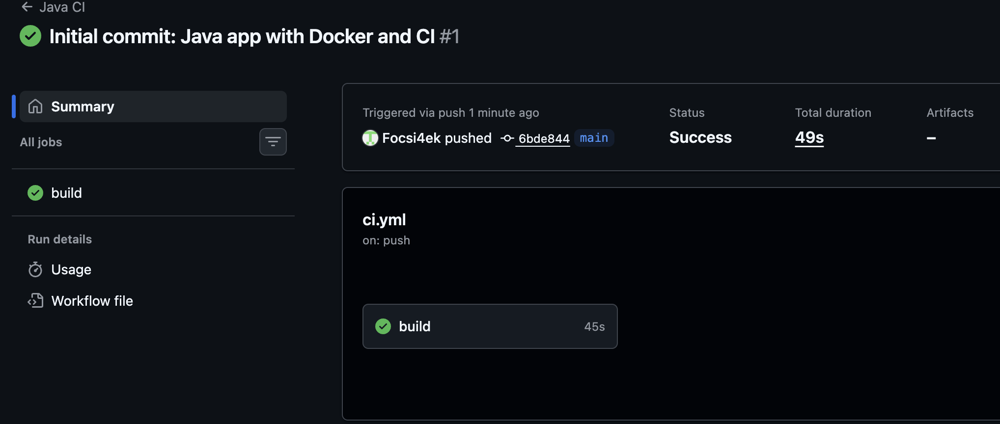
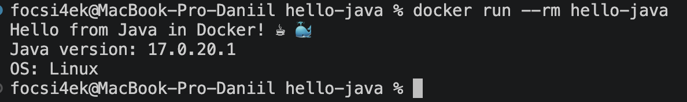

# ☕ Java CI Pipeline with Maven, Docker & GitHub Actions

**Автор:** Абрамов Даниил Сергеевич

Учебный проект для изучения **Continuous Integration (CI)** на примере Java-приложения с использованием **Apache Maven, JUnit 5, Docker и GitHub Actions**.

Проект автоматически собирается и тестируется через GitHub Actions, после чего создаётся Docker-образ готового приложения.

---

## 🎯 Цель проекта

Основная цель — познакомиться с построением CI Pipeline для Java и понять взаимодействие:

- Java 17
- Apache Maven
- JUnit 5
- Maven Shade Plugin
- Docker
- Multi-stage Build
- GitHub Actions

В рамках проекта реализованы:

- сборка Java-проекта через Maven
- автоматический запуск unit-тестов
- создание исполняемого JAR
- использование Maven lifecycle
- контейнеризация приложения
- multi-stage Docker build
- автоматическая сборка через GitHub Actions
- Maven Cache
- локальная проверка без установки Java и Maven на macOS

---

## 🛠️ Используемые технологии

| Технология | Назначение |
|---|---|
| ☕ Java 17 | Основной язык приложения |
| 📦 Apache Maven | Сборка и управление зависимостями |
| 🧪 JUnit 5 | Unit-тестирование |
| 📦 Maven Surefire Plugin | Запуск тестов |
| 📦 Maven Shade Plugin | Создание исполняемого JAR |
| 🐳 Docker | Контейнеризация |
| ⚙️ GitHub Actions | Автоматизация CI |
| ☕ Eclipse Temurin | JDK/JRE |
| Git | Контроль версий |
| GitHub | Хранение исходного кода |

---

## 📁 Структура проекта

    hello-java/
    ├── .github/
    │   └── workflows/
    │       └── ci.yml
    │
    ├── src/
    │   ├── main/
    │   │   └── java/
    │   │       └── Hello.java
    │   │
    │   └── test/
    │       └── java/
    │           └── HelloTest.java
    │
    ├── pom.xml
    ├── Dockerfile
    ├── .gitignore
    ├── README.md
    ├── 01-github-actions-success.png
    └── 02-docker-run-success.png

---

## ☕ Приложение

Основной код находится в:

    src/main/java/Hello.java

Программа выводит:

    Hello from Java in Docker! ☕🐳
    Java version: 17...
    OS: Linux

Основной код:

    public class Hello {
        public static void main(String[] args) {
            System.out.println("Hello from Java in Docker! ☕🐳");
            System.out.println("Java version: " + System.getProperty("java.version"));
            System.out.println("OS: " + System.getProperty("os.name"));

            if (args.length > 0) {
                System.out.println("Аргументы:");

                for (int i = 0; i < args.length; i++) {
                    System.out.println("  " + (i + 1) + ": " + args[i]);
                }
            }
        }
    }

---

## 📦 Apache Maven

Для сборки проекта используется **Apache Maven**.

Основная конфигурация находится в:

    pom.xml

Maven отвечает за:

- управление зависимостями
- компиляцию Java-кода
- запуск тестов
- создание JAR
- запуск Maven Plugins
- подготовку production-сборки

---

## 🔄 Maven Lifecycle

В проекте используются основные Maven-фазы.

### clean

Удаляет результаты предыдущей сборки:

    mvn clean

Удаляется каталог:

    target/

### verify

Выполняет полный набор проверок:

    mvn clean verify

Схема:

    Compile
      ↓
    Test
      ↓
    Package
      ↓
    Verify

Эта команда используется в GitHub Actions.

### package

Создаёт JAR:

    mvn package

Результат:

    target/hello-java.jar

---

## 🧪 JUnit 5

Для тестирования используется **JUnit Jupiter 5.10.2**.

Тесты находятся в:

    src/test/java/HelloTest.java

Проверяются:

- наличие текста `Hello`
- наличие текста `Docker`
- простая математическая операция

Пример:

    @Test
    void testGreeting() {
        String greeting = "Hello from Java in Docker!";

        assertTrue(greeting.contains("Hello"));
        assertTrue(greeting.contains("Docker"));
    }

    @Test
    void testSimpleMath() {
        assertEquals(4, 2 + 2);
    }

При успешном выполнении:

    Tests run: 2
    Failures: 0
    Errors: 0
    Skipped: 0

---

## 📦 Maven Surefire Plugin

Для запуска JUnit-тестов используется:

    maven-surefire-plugin

Версия:

    3.2.5

Тесты автоматически запускаются при:

    mvn test

и:

    mvn verify

---

## 📦 Maven Shade Plugin

Для создания готового исполняемого JAR используется:

**Maven Shade Plugin**

Главный класс:

    Hello

Это позволяет запускать приложение командой:

    java -jar hello-java.jar

---

## 🏗️ Fat JAR

Схема сборки:

    Java Source
        ↓
    Maven Compile
        ↓
    JUnit Tests
        ↓
    Maven Package
        ↓
    Shade Plugin
        ↓
    hello-java.jar

---

## 🐳 Docker

Для контейнеризации используется **multi-stage Docker build**.

Первый этап содержит Maven и JDK и нужен только для сборки.

Второй этап содержит только JRE и готовый JAR.

---

## 🏗️ Docker Architecture

    ┌──────────────────────────────────────┐
    │  maven:3.9-eclipse-temurin-17       │
    │                                      │
    │          Builder Stage               │
    └──────────────────┬───────────────────┘
                       │
                       ▼
                Maven Package
                       │
                       ▼
                hello-java.jar
                       │
                       ▼
    ┌──────────────────────────────────────┐
    │  eclipse-temurin:17-jre-jammy       │
    │                                      │
    │          Runtime Stage               │
    └──────────────────┬───────────────────┘
                       │
                       ▼
                  java -jar
                       │
                       ▼
                   app.jar

---

## 🐳 Dockerfile

Рабочий Dockerfile:

    FROM maven:3.9-eclipse-temurin-17 AS builder

    WORKDIR /build

    COPY pom.xml .
    COPY src ./src

    RUN mvn clean package -DskipTests

    FROM eclipse-temurin:17-jre-jammy

    WORKDIR /app

    COPY --from=builder /build/target/hello-java.jar app.jar

    ENTRYPOINT ["java", "-jar", "app.jar"]

---

## 🍎 Совместимость с Apple Silicon

Изначально runtime-образ был:

    eclipse-temurin:17-jre-alpine

На Mac с Apple Silicon возникла проблема совместимости архитектуры.

Поэтому был использован:

    eclipse-temurin:17-jre-jammy

После этого Docker-образ успешно собрался и запустился.

---

## 🧪 Локальная Maven-сборка через Docker

Java и Maven необязательно устанавливать локально.

Создание Maven Cache:

    mkdir -p ~/.m2-docker-cache

Запуск:

    docker run --rm \
      -u "$(id -u):$(id -g)" \
      -e HOME=/tmp \
      -e MAVEN_CONFIG=/tmp/.m2 \
      -v "$(pwd):/app" \
      -v ~/.m2-docker-cache:/tmp/.m2 \
      -w /app \
      maven:3.9-eclipse-temurin-17 \
      mvn clean verify

Ожидаемый результат:

    BUILD SUCCESS

---

## ⚡ Maven Cache

Каталог:

    ~/.m2-docker-cache

используется для сохранения зависимостей Maven между локальными Docker-запусками.

Это ускоряет повторные сборки.

---

## 🔨 Сборка Docker-образа

    docker build -t hello-java .

Проверка:

    docker images | grep hello-java

---

## ▶️ Запуск контейнера

    docker run --rm hello-java

Ожидаемый результат:

    Hello from Java in Docker! ☕🐳
    Java version: 17...
    OS: Linux

Параметр:

    --rm

удаляет контейнер после завершения.

---

## ⚙️ GitHub Actions

Workflow находится по пути:

    .github/workflows/ci.yml

Название:

    Java CI

Pipeline автоматически запускается при push в:

    main

и при Pull Request.

---

## 🔄 CI Pipeline

Схема:

    Developer
        │
        │ git push
        ▼
    GitHub Repository
        │
        ▼
    GitHub Actions
        │
        ▼
    ┌──────────────────────────────┐
    │         Setup JDK 17         │
    │                              │
    │      Eclipse Temurin         │
    │      Maven Cache             │
    └──────────────┬───────────────┘
                   │
                   ▼
    ┌──────────────────────────────┐
    │       Build and Test         │
    │                              │
    │      mvn clean verify        │
    │      JUnit 5                 │
    └──────────────┬───────────────┘
                   │
                   ▼
    ┌──────────────────────────────┐
    │      Build Docker Image      │
    │                              │
    │      docker build            │
    └──────────────┬───────────────┘
                   │
                   ▼
               ✅ Success

---

## 🚀 Этапы GitHub Actions

### 1. Checkout

    actions/checkout@v4

### 2. Setup JDK 17

    actions/setup-java@v4

Используется:

    java-version: 17
    distribution: temurin

### 3. Maven Cache

    cache: maven

### 4. Build and Test

    mvn clean verify

### 5. Docker Build

    docker build -t hello-java .

---

## 🆚 Maven Build и Docker Build

Это разные этапы:

| Maven Build | Docker Build |
|---|---|
| Компилирует Java | Создаёт контейнер |
| Запускает JUnit | Подготавливает runtime |
| Создаёт JAR | Помещает JAR в image |
| Проверяет код | Проверяет Dockerfile |
| Результат — JAR | Результат — Docker image |

Схема:

    Source Code
         ↓
    Maven Build
         ↓
    hello-java.jar
         ↓
    Docker Build
         ↓
    Docker Image

---

## 🖥️ Результат GitHub Actions

После push Pipeline запускается автоматически.

Успешно выполняются:

- Checkout — ✅
- Setup JDK 17 — ✅
- Maven Build — ✅
- JUnit Tests — ✅
- Docker Build — ✅

---

## 🐳 Результат локального запуска

    docker run --rm hello-java

Результат:

    Hello from Java in Docker! ☕🐳
    Java version: 17...
    OS: Linux

---

## ✅ Что проверяет CI

| Этап | Инструмент |
|---|---|
| Получение исходного кода | actions/checkout |
| Установка JDK | setup-java |
| Кэширование Maven | Maven Cache |
| Очистка проекта | Maven clean |
| Компиляция | Maven Compiler |
| Unit-тесты | JUnit 5 |
| Проверка проекта | Maven verify |
| Создание JAR | Maven Shade Plugin |
| Создание Docker-образа | Docker |

---

## 📌 Continuous Integration

После:

    git push

GitHub Actions автоматически выполняет:

    Checkout
        ↓
    Setup JDK 17
        ↓
    Maven Cache
        ↓
    mvn clean verify
        ↓
    JUnit Tests
        ↓
    Package JAR
        ↓
    Docker Build
        ↓
      ✅ Success

---

## 📚 Полученные навыки

В рамках проекта были освоены:

- создание CI Pipeline для Java
- работа с Maven
- структура pom.xml
- Maven clean
- Maven verify
- Maven package
- JUnit 5
- Maven Surefire Plugin
- Maven Shade Plugin
- создание executable JAR
- Maven Cache
- multi-stage Docker build
- использование JDK и JRE
- работа с GitHub Actions
- различие Maven Build и Docker Build
- запуск Java-приложения в контейнере

---

## 🎯 Итог

В проекте создан полноценный учебный **CI Pipeline для Java-приложения**.

GitHub Actions автоматически устанавливает JDK 17, использует Maven Cache, выполняет сборку и JUnit-тестирование через Maven, после чего создаёт Docker-образ готового приложения.

Итоговая схема:

    Java Code
        ↓
    Maven
        ↓
    Compile
        ↓
    JUnit
        ↓
    Verify
        ↓
    Shade Plugin
        ↓
    JAR
        ↓
    Docker Build
        ↓
    ✅ Success

Проект демонстрирует практическое взаимодействие **Java, Maven, JUnit, Docker и GitHub Actions** в рамках Continuous Integration.

---

## 👨‍💻 Автор

**Абрамов Даниил Сергеевич**

**Java CI Pipeline © 2026**